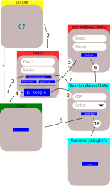
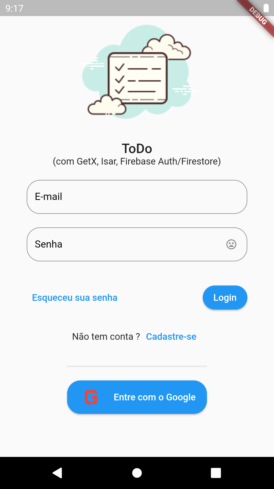
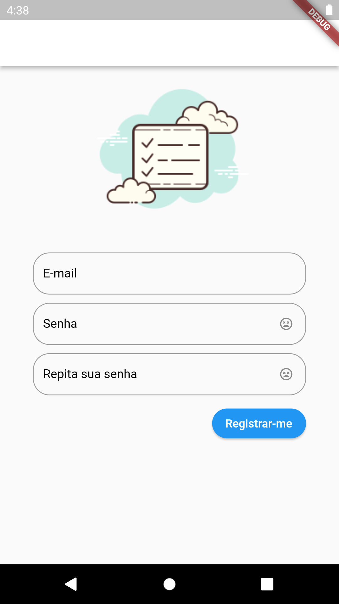
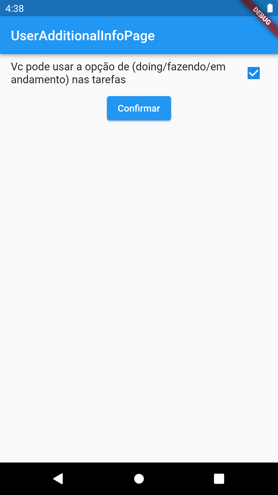
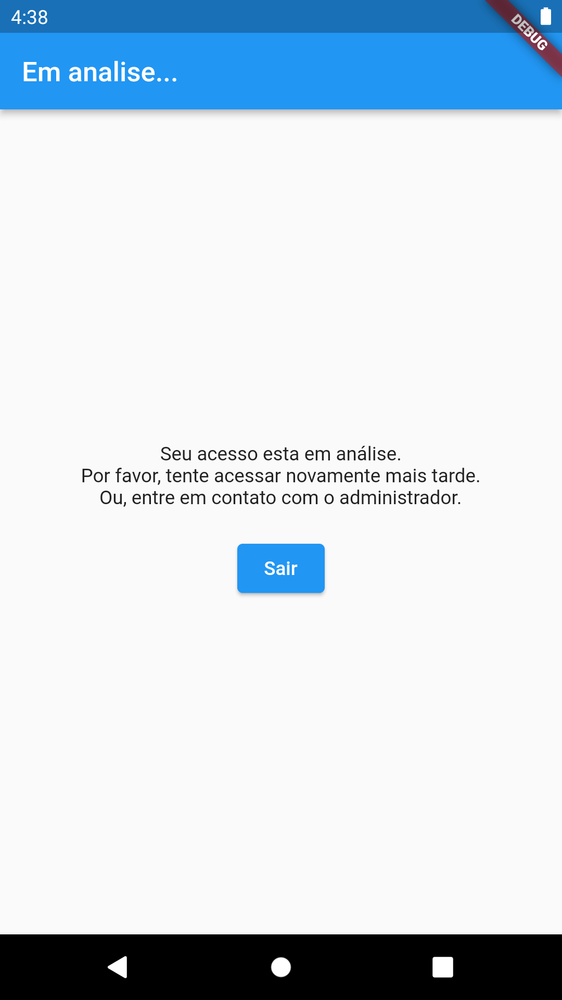
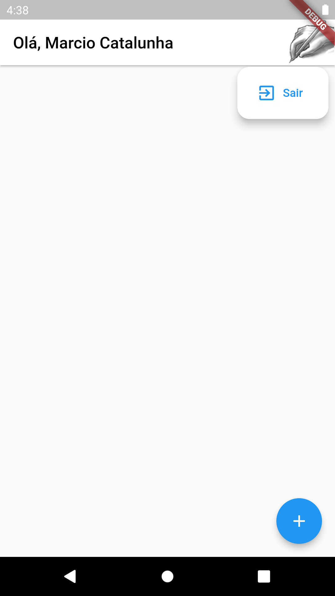

# ToDo
Pra muitos é mais um ToDo. Pra mim é uma conquista e um compartilhamento.

Abordei o meu entendimento de V-VM-M, [Estrutura](#estrutura), e aceito sugestões.

Construi um fluxo de authenticação bem interessante e genérico como visto no item [Authentication](#authentication)

As contribuições/fontes para este ToDo estão nesta [minha historia](https://medium.com/@catalunha.mj/deploy-app-flutter-android-para-flutter-web-no-firebase-hosting-5d39d5e48c5) no Medium.

# Estrutura

Analise e adaptação, a View - ViewModel - Model, destes textos:
* http://kyubid.com/blog/mvvm-android-tutorial-01-mvc-vs-mvp-vs-mvvm/
* https://pub.dev/packages/flutter_clean_architecture
* https://medium.com/@ajliberatore/android-clean-architecture-mvvm-4df18933fa9
* https://medium.com/@fahrizalfms/sample-android-project-mvvm-clean-architecture-with-coroutines-tips-a4d1b43b3583

# Authentication
O Fluxo de autenticação segue esta abordagem:
1. Usuário acessa ao aplicativo e **splash.page** analisa sua situação. Se estiver logado vai para **home.page**.
2. Usuário acessa ao aplicativo e **splash.page** analisa sua situação. Se não estiver logado vai para **login.page**.
3. Usuário informa email/senha e se cadastrado e informações adicionais regularizadas e vai para **home.page**.
4. Usuário informa provedor de acesso e se cadastrado e informações adicionais regularizadas vai para **home.page**.
5. Se solicitar cadastrar email/senha para acesso vai para **methodEmailSenha.page**.
6. Após informar email/senha para cadastro se existir informações adicionais segue para **UserAdditionalInfo.page**.
7. Usuário informa email/senha e se cadastrado e informações adicionais irregulares vai para **UserAdditionalInfo.page**.
8. Usuário informa provedor de acesso e se cadastrado e informações adicionais irregulares vai para **UserAdditionalInfo.page**.
9. Registrada as informações adicionais se não houver analise vai para **home.page**.
10. Registrada as informações adicionais se houver analise vai para **UserAnalyzingInfo.page**. E espera-se liberação dos administradores do app. 

# Telas do App
Conforme apresentado acima seguem as telas 

|login.page|b|
|---|---|
|||
|||
|||

# isar

1. https://tomicriedel.medium.com/flutter-isar-database-the-complete-crash-course-part-1-bbd08aa7cc4e
2. https://isar.dev/tutorials/quickstart.html
3. https://pub.dev/packages/isar
4. 
